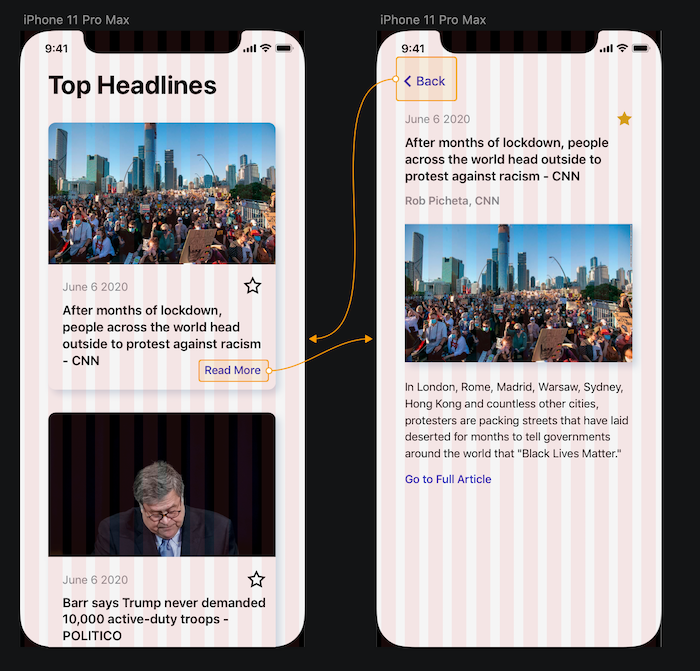
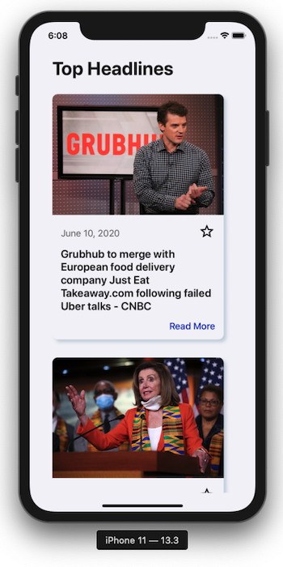
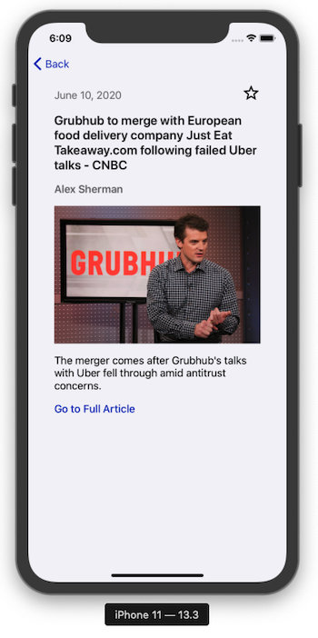
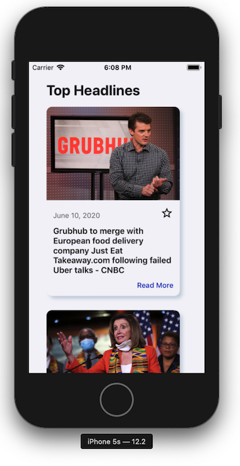
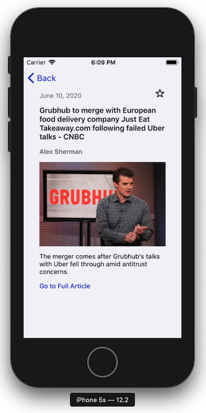
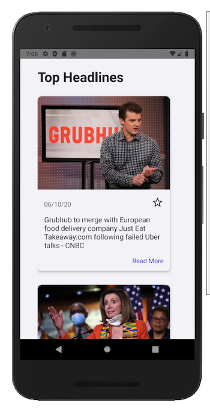

# 🗞 React Native News App 🗞

## Project Description

This cross-platform mobile application lets you see the latest US news headlines provided by [News API](https://newsapi.org).

This app is optimized for different screen sizes and orientations and also uses GraphQL to consume the REST API.

## Installation

Please set up a [React Native development environment](https://reactnative.dev/docs/environment-setup) if you have not already done so.

You will also need to create an `.env` file in the root and add your API key for [News API](https://newsapi.org):

```
API_KEY=YOURKEYHERE
```

### Running iOS on a Mac via a simulator

If you wish to install using [Bundler](https://bundler.io/), please see the advanced iOS install instructions at the end of this README. Otherwise, make sure you have a version of CocoaPods installed, and run the following commands:

```
npm i
cd ios
pod install
cd ..
npx react-native run-ios
```

### Running Android on a Mac or PC

Attach a device or run an emulator and run the following commands:

```
npm i
npx react-native run-android
```

## The Development Process

### UI Design Process

Before starting development, I created a quick UI design in Sketch with a simple 12-column grid:



### Development Process

To start development, I cloned [my own personal React Native project template repo](https://github.com/jrapala/react-native-template) which includes the following:

-   A TypeScript config
-   Lots of fun ESLint rules
-   Stylelint rules
-   Prettier rules
-   A styled-components setup with a very basic theme and design system
-   A Bundler set up to maintain consistent iOS environments

The rest of the app was built on top of this template.

Some items of note:

-   The React Context API is used to manage the state of the starred articles. No ids were provided in the News API article payloads, so I'm using the article title as a unique identifier. I'm making the assumption that titles will not be repeated.
-   I did not find a GraphQL endpoint for the News API, so I wrapped the REST API in a GraphQL layer.
-   This incorporates one theme -- a light mode iOS theme. Ideally, I would have themes for light and dark modes for both iOS and Android.
-   A component directory structure is used to keep future Storybook stories, component tests, and snapshot tests together in one location.

## Ideas for Future Development

-   Add a test suite that includes unit tests, integration tests, and E2E tests.
-   Device specific themes (iOS and Android), as well as dark and light themes for both platforms.
-   Add a Splash Screen.
-   Add an app icon.
-   Add tablet specific UI designs. Perhaps render multiple article cards per row?
-   Add better transition animations. Perhaps a shared element transition (the image being the shared element) when navigating from the headlines to the details page?
-   Add loading indicators or placeholders for images as they load.
-   Lazy load additional articles as the user scrolls through the list.
-   Accessibility tests using VoiceOver and TalkBack

## Screenshots

    

### (Bonus) Advanced iOS Development Instructions (using Bundler)

#### 1. Install Ruby

This project requires Ruby 2.7.0. It can be installed with `rbenv`:

`brew install rbenv`

Then run `rbenv init` and follow the instructions to finish installation.

To install 2.7.0: `rbenv install 2.7.0`

To use 2.7.0: `rbenv local 2.7.0` or `rbenv global 2.7.0` (to override global version), followed by `rbenv rehash`

#### 2. Install Packager

`gem install bundler`

#### 4. Install CocoaPods

`bundle install`

#### 5. Install Pods

```
cd ios
npm run podInstall
cd ..
```

#### 6. Run Project

`npx react-native run-ios`
